  

---

<h2 align="center">👨‍💻 About Me</h2>

I am a <b>Computer Engineer</b> specialized in Information Management and Systems, 
with a strong passion for 🔒 <b>Cybersecurity</b> and ✨ <b>Artificial Intelligence</b>.

<table>
  <tr>
    <td>💼</td>
    <td><b>Currently</b></td>
    <td>Cybersecurity Consultant at <b>EY</b></td>
  </tr>
  <tr>
    <td>🛡️</td>
    <td><b>Focus</b></td>
    <td>Identifying and mitigating security risks</td>
  </tr>
  <tr>
    <td>🤖</td>
    <td><b>Interests</b></td>
    <td>AI, security &amp; new tech advancements</td>
  </tr>
  <tr>
    <td>🤝</td>
    <td><b>Open to</b></td>
    <td>Connecting with the tech community — feel free to reach out!</td>
  </tr>
</table>

---

  <picture>
    <source media="(prefers-color-scheme: dark)" srcset="assets/languages-dark.svg">
    <source media="(prefers-color-scheme: light)" srcset="assets/languages-light.svg">
    
  </picture>

---

<h3 align="center">🛠️ Building useful things.</h3>

